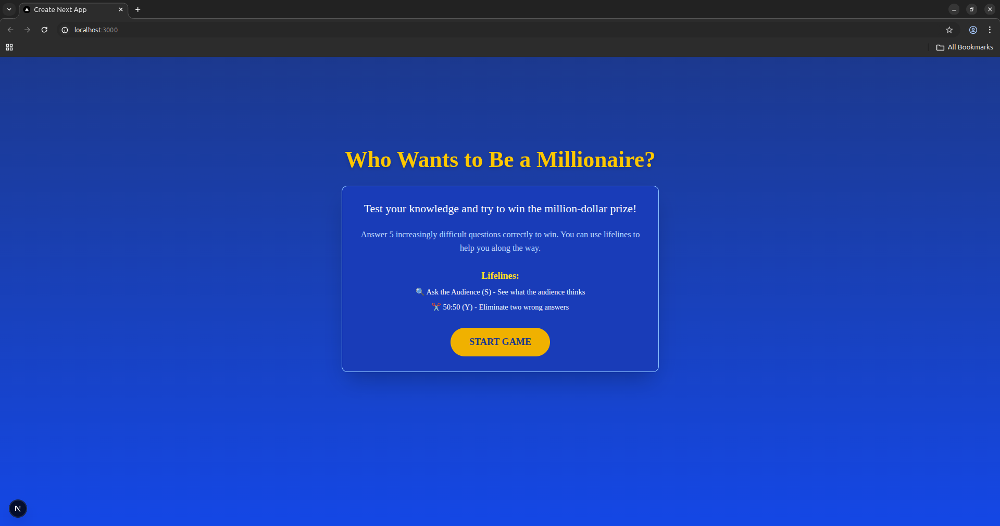
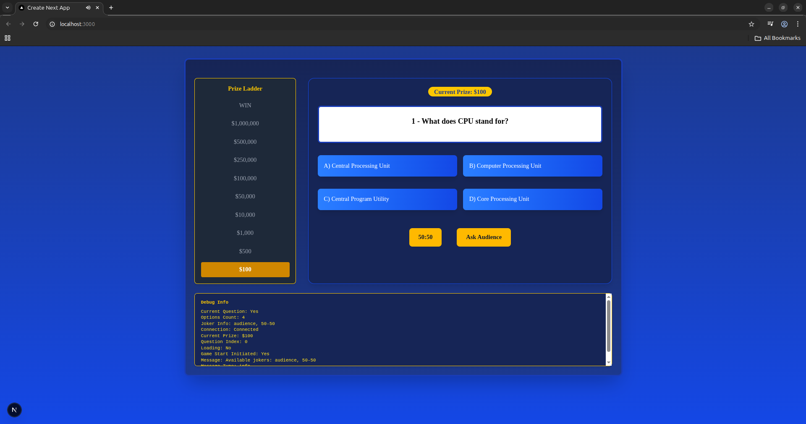
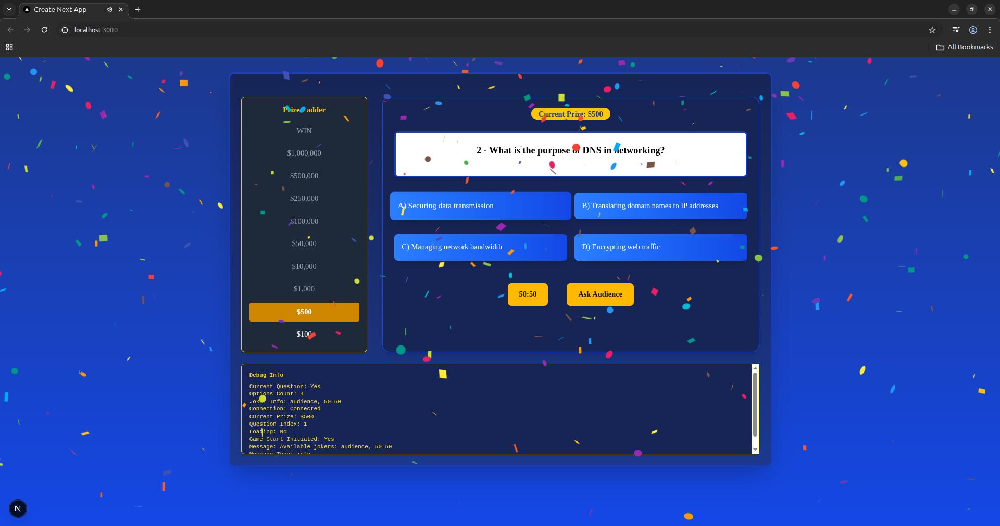
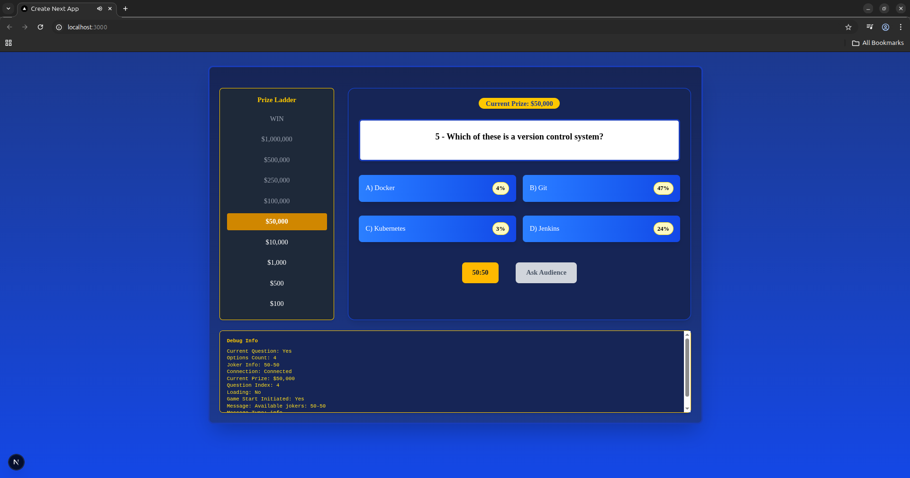
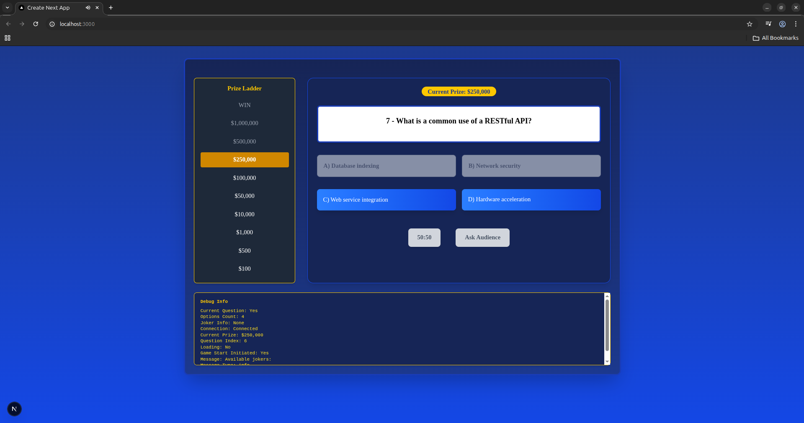
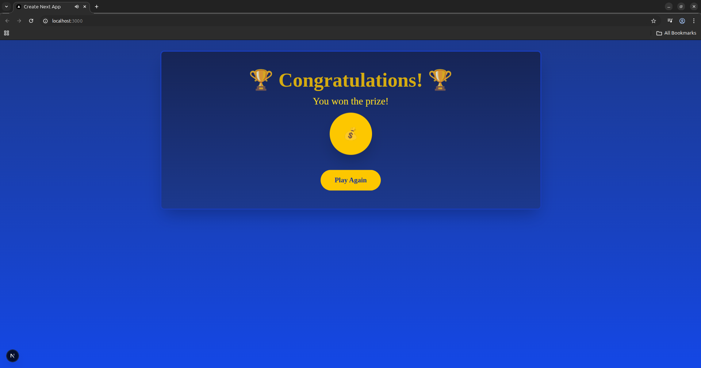
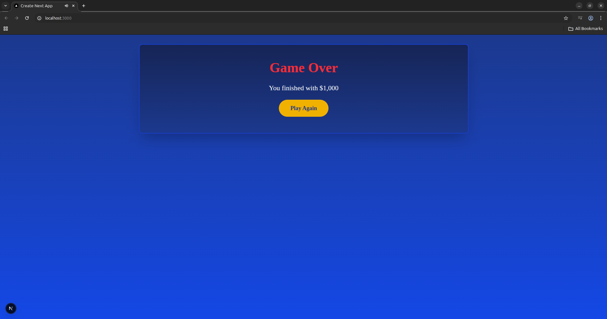

# Who Wants to Be a Millionaire Game

This repository contains a "Who Wants to Be a Millionaire" game implementation with a backend written in C++ and a frontend built with Next.js.

## Project Overview

This project is a digital version of the popular TV quiz show "Who Wants to Be a Millionaire". It features:

- A C++ backend game server
- A Node.js adapter layer
- A modern Next.js frontend
- Docker containerization for easy deployment

## Architecture

The application is structured as a three-tier architecture:

1. **Backend**: Written in C++, handles game logic and question management
2. **Adapter**: Node.js service that facilitates communication between frontend and backend
3. **Frontend**: Next.js application that provides the user interface

## Project Presentation

The project includes a detailed presentation:

- [Millionaire Presentation](./Millionaire_presentation.pptx)

## Game Screenshots

Here are some screenshots of the game in action:

### Game Interface


### Question Screen


### Correct Answer



### Using Audience Jokers


### Using 50:50 Jokers


### Winning Moment


### Game Over Screen


## Getting Started

### Prerequisites

- Docker and Docker Compose

### Running the Application

1. Clone this repository
2. Run the following command (if you have linux):

```bash
./start_all.sh
```

Alternatively, you can build and run the containers manually:

```bash
docker compose up --build
```

3. Access the game at: http://localhost:3000

## Project Structure

- `backend/`: C++ server implementation
  - `common/`: Shared libraries and utilities
  - `host/`: Game host service
  - `joker/`: Joker service implementation
  - `data/`: Game questions and data
- `frontend/`: Next.js application
  - `src/adapter/`: Node.js adapter service
  - `src/components/`: React components
  - `src/context/`: React context providers
  - `public/sounds/`: Game sound effects

## License

This project is for educational purposes.
